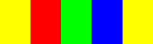
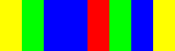
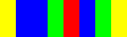
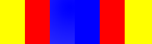
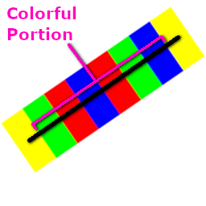

# BarCodeFinder
Right away, let me be clear: this project does *not* refer to the black-and-white bar codes, such as UPC, that you see on products in a store. For this project, a bar code consists of red, green, and blue blocks with yellow boxes at both endpoints.

Examples:

|     BarCode Sequence     | Visual                      |
|--------------------------|-----------------------------|
| RGB                      |          |
| GBBRGB                   |    |
| BBGRBG                   |  |
| RBBR                     |        |

This library can quickly scan a bitmap to find certain bar code sequences.

#### Requirements
This library uses AVX intrinsics to optimize scanning, and is expected to be run on a 64-bit machine. The input bitmaps are expected to be memory-aligned for AVX use. The .Net library is simply a wrapper for the native library, so the same requirements apply to it. The bitmaps must have a width that is divisible by 8, and are expected to have minimal noise and reasonable lighting, and the background should not have many 'yellow' pixels (as defined by the `YellowConfig` structure).

#### Usage
##### Native
The main function of this library is `find_appearances_of_bar_code_interests_in_bitmap`. It takes in a RGBA8 bitmap, `YellowConfig` structure, and an array of `BarCodeFindContext`s. Each `BarCodeFindContext`'s `appearance buffer` will be filled with all `BarCodeAppearance`s that matched the specific BarCode for that BarCodeFindContext, sorted such that the first BarCodeAppearance was the closest match.

##### .Net
The main .net class for this library is `BarCodeFinder`, which has a `Find` method that resembles the native `find_appearances_of_bar_code_interests_in_bitmap` function.

##### Demo Program
The `BarCodeFinderDemo` project is a simple .net console application that takes a path to an image and a certain bar code sequence, then saves an output image with all appearances of that bar code labeled. For the BarCodeAppearance with the highest 'match score', a blue line will be drawn at the 'colorful portion' of the bar code and cyan boxes will surround its yellow endpoints. For the remaining BarCodeAppearances, a red line will show the colorful portion and yellow boxes will surround the yellow endpoints. Near each colorful portion line, red text will show that bar code's match score. At the bottom of the image, a string will display the searched bar code sequence as well as the highest match score. Each pixel that was considered yellow will be converted to green. This demo has a hard-coded YellowConfig that you may change in `Program.cs`.

Examples from the demo program:  
[Example 1](img/Demo/BRGGR.png)  
[Example 2](img/Demo/GRBBB.png)  
[Example 3](img/Demo/GRGRB.png)  
[Example 4](img/Demo/GRRBB.png)  
[Example 5](img/Demo/GRRRR.png)  
[Example 6](img/Demo/RRGGR.png)  

## License
This API is licensed under the terms of the MIT license, which is detailed in [LICENSE.txt](LICENSE.txt).

## How it works
#### Finding yellow pixels
As briefly described at the start of this document, a bar code is a set of color blocks arranged in a line, with yellow blocks at both endpoints. This library first scans the bitmap to identify which pixels are considered yellow, as defined by a `YellowConfig` structure. Tuning the YellowConfig is perhaps the most important, and difficult, step in getting this library to work in a particular environment. It is important that the yellow endpoints are clearly detected and distinguished. If yellow pixels are not detected, then that bar code will definitely not be detected. So in general, you may want to *round up* the detection even if you get a little yellow noise in the background. However, you must ensure that none of the segments within the bar code (that is, the red, green, and blue portions) are detected as yellow. To visualize which pixels on a bitmap are considered yellow for a certain YellowConfig, use the `show_yellow` function.

#### Finding yellow scan lines
Once all pixels have been defined as yellow or not-yellow, the API will generate a set of `YellowScanLine`s (see `find_yellow_lines`). These scan lines are used to optimize the scan process, since it is expected that there will be many yellow pixels side-by-side.
#### Finding yellow bounding boxes
When the yellow scan lines have been found, this API will generate a set of `YellowBoundingBox`es that surround them (see `find_yellow_rectangles`). These yellow bounding boxes are the primary starting point in finding the bar codes. 
#### Finding bar code appearances
The API will search through all `YellowBoundingBox`es, reading two at a time (to form a line). Given two yellow bounding boxes, the API will follow the line between those boxes to find where the `colorful` portion of the line begins and ends (that is: where the red, green, or blue pixels begin and end). See `_find_colorful_line_endpoints`.

#### Reading the colorful line
When the colorful line is found, the API will divide it into segments based on the number of segments in the `BarCode` that the application wants to find. These segments, as well as the yellow bounding boxes, will define a `BarCodeAppearance`. The API will then read each pixel on each segment, and quantify the redness, greenness, and blueness of each pixel on that segment via the `quantify_red`, `quantify_green`, and `quantify_blue` functions. You may want to alter these functions to fit your environment. In the end, each BarCodeAppearance's segment will have an average redness, greenness, and blueness value. See `find_bar_code_appearances` and `_read_bar_code_appearance`.

#### Quantifying a bar code appearance
Once a set of `BarCodeAppearance`s is obtained, the API will then be able to compare them to a specific `BarCode` using the `quantify_bar_code_appearance_match` function. This function reads the average redness, greenness, and blueness for each segment in the `BarCodeAppearance` and compares it to each segment in the `BarCode`. Since palindromes are possible, the API will take the highest match (that is: the segments will be read in 'forward' and 'reverse', and the direction with the highest score will be used).
